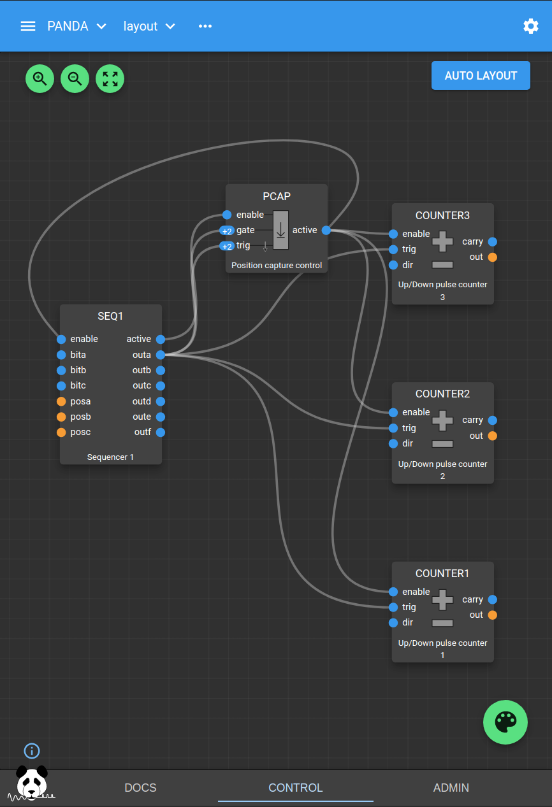

.. _tutorial-load-save:

Commandline Load/Save Tutorial
==============================

This tutorial shows how to use the commandline tool to save the state of all the
Blocks and Fields in a PandA, and load a new state from file. It assumes that
you know the basic concepts of a PandA as outlined in the PandABlocks-FPGA
blinking LEDs tutorial_.

Save
----

You can save the current state using the save command as follows::

    $ pandablocks save <hostname> <save_file>

The save file is a text file containing the sequence of pandablocks control
commands that will set up the PandA to match its state at the time of the save.
This is a human readable file and may be edited if you want to modify a few
fields.

e.g. the first few lines of the tutorial save file look like this:

.. literalinclude:: ../../../src/pandablocks/saves/tutorial.sav
   :lines: 1-12

Load
----

To restore a PandA to a previously saved state use the load command as follows::

    $ pandablocks load <hostname> <save_file>

This is equivalent to typing the sequence of commands in <save_file> into the
pandablocks control command line.

To load the preconfigured tutorial state::

    $ pandablocks load <hostname> --tutorial

The tutorial sets up a Seqencer block driving 3 Counter blocks and a Position
Capture block. This configuration is the starting point for the next tutorial:
:ref:`commandline-hdf`

.. note::

    The Web UI will not change the Blocks visible on the screen when you use
    ``pandablocks load``. If you want all the connected Blocks to appear in the
    UI then restart the services on the PandA (Admin > System > Reboot/Restart)

The tutorial blocks are wired up as shown in the following Web UI layout.

.. _tutorial: https://pandablocks-fpga.readthedocs.io/en/latest/tutorials/tutorial1_blinking_leds.html
